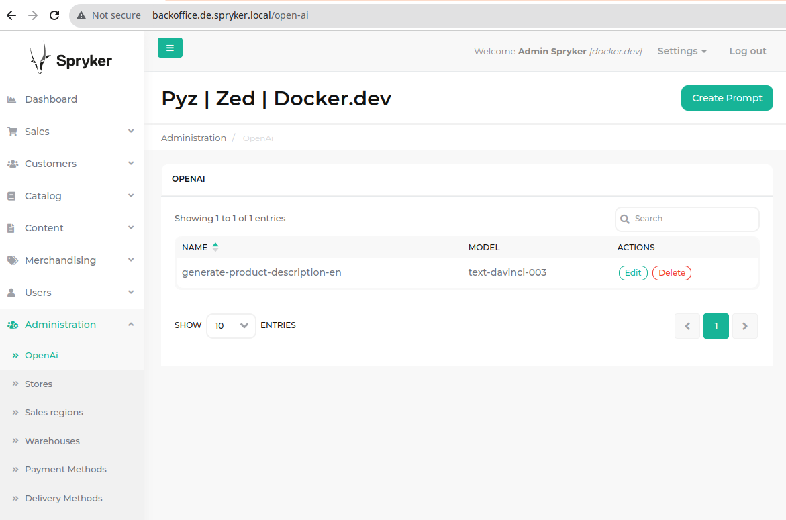
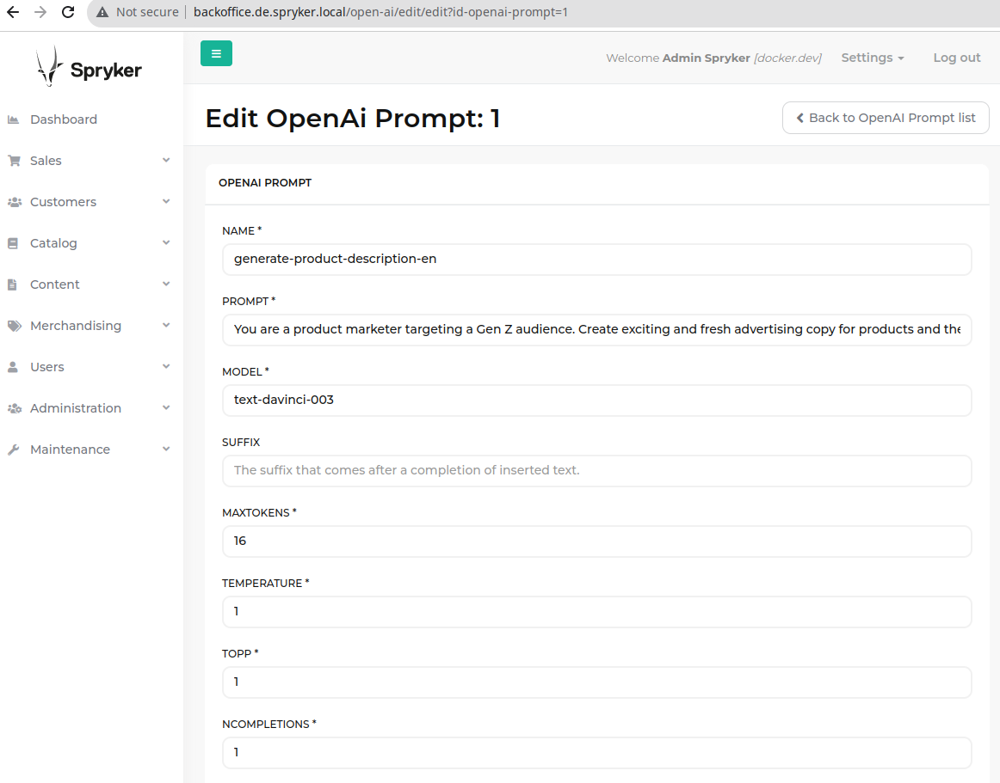
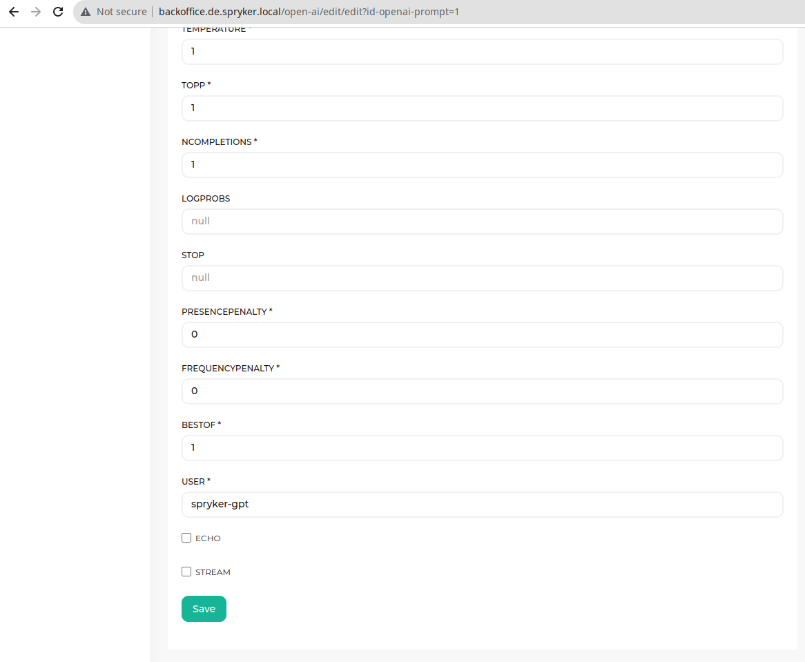
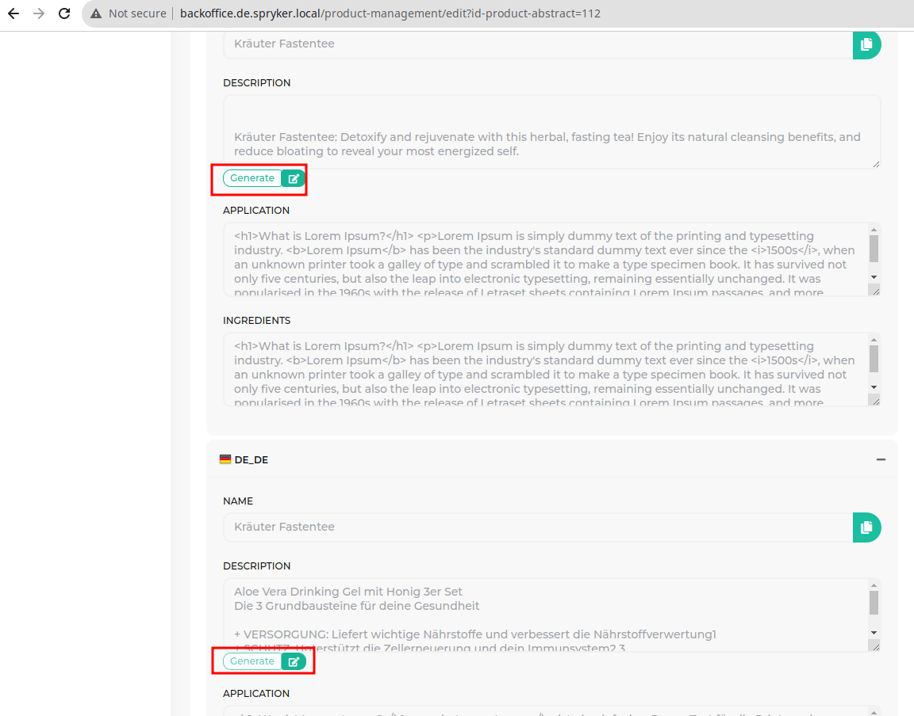
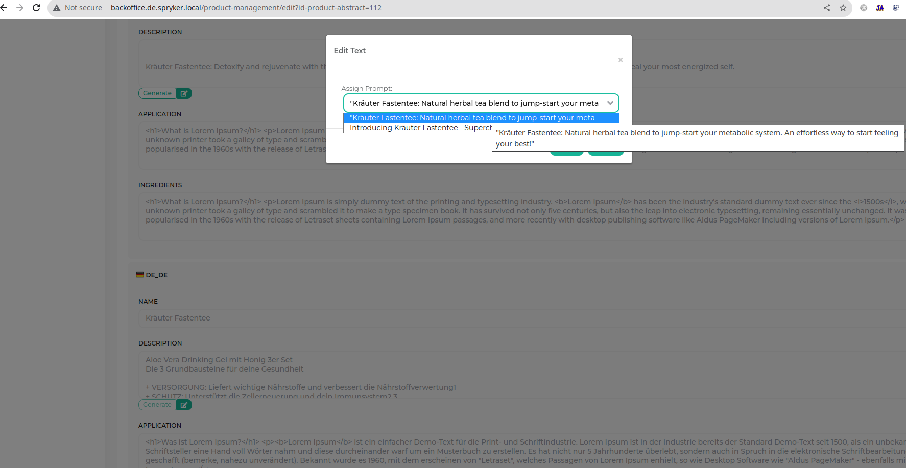

# Open AI Spryker package

# Description
 - OpenAI Client for spryker
 - BO UI to manage prompts 
 - BO UI to generate product descriptions
 - 

 - 
# Example usage
 - https://gitlab.nxs360.com/packages/php/spryker/open-ai/-/blob/main/src/ValanticSpryker/Zed/OpenAi/Communication/Console/OpenAiConsole.php#L39
 - https://github.com/openai-php/client

# Install
- composer require the package `composer req valantic-spryker/open-ai:^1.0.4` (see https://gitlab.nxs360.com/groups/packages/php/spryker/-/packages)
- configure your openai key in your config `$config[OpenAiConstants::OPENAI_API_KEY] = 'xxxxxx';` (https://platform.openai.com/account/api-keys)
- `console propel:install`
- `console transfer:generate`
- load open-ai js in your backoffice twig (see `Zed/Gui/Presentation/Layout/layout.twig:5`)
- `console twig:cache:warmer` 
- add to your projects backoffice navigation.xml (see `src/config/Zed/navigation.xml:370`)
- `console navigation:build-cache`
- `console router:cache:warm-up:backoffice`
- build frontend (`npm run zed`)

# Reference implementation
- unknown

# HowTos Cli

PHP Container: `docker run -it --rm --name my-running-script -v "$PWD":/data spryker/php:latest bash`

Run Tests: `codecept run --env standalone`

Fixer: `vendor/bin/phpcbf --standard=phpcs.xml --report=full src/ValanticSpryker/`

Disable opcache: `mv /usr/local/etc/php/conf.d/docker-php-ext-opcache.ini /usr/local/etc/php/conf.d/docker-php-ext-opcache.iniold`

XDEBUG:
- `ip addr | grep '192.'`
- `$docker-php-ext-enable xdebug`
- configure phpstorm (add 127.0.0.1 phpstorm server with name valantic)
- `$PHP_IDE_CONFIG=serverName=valantic php -dxdebug.mode=debug -dxdebug.client_host=192.168.87.39 -dxdebug.start_with_request=yes ./vendor/bin/codecept run --env standalone`

- Run Tests with coverage: `XDEBUG_MODE=coverage vendor/bin/codecept run --env standalone --coverage --coverage-xml --coverage-html`

# use nodejs
 - docker run -it --rm --name my-running-script -v "$PWD":/data node:18 bash
